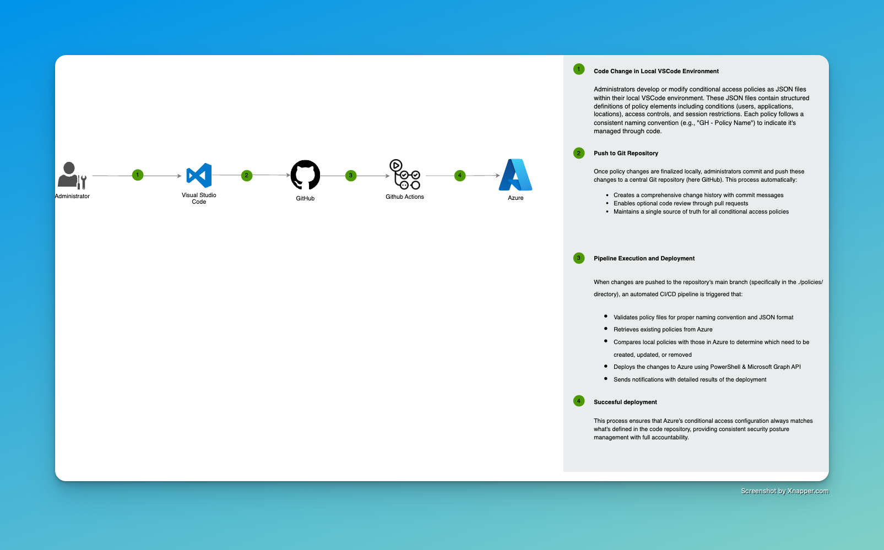
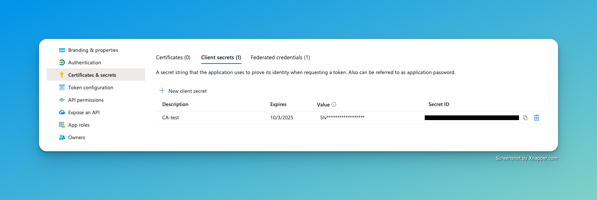
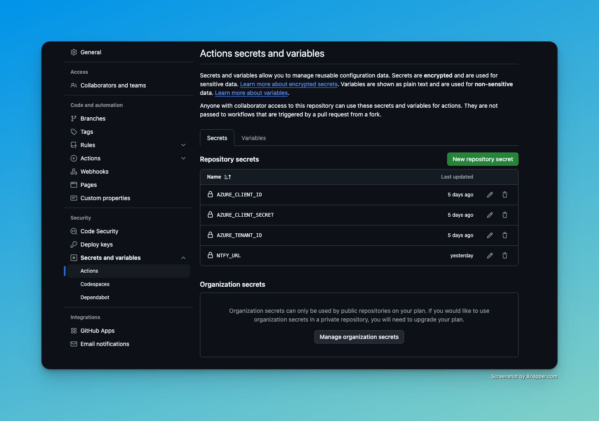
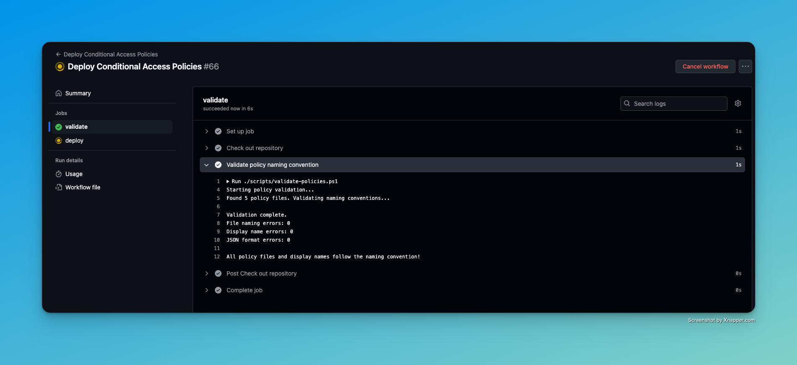
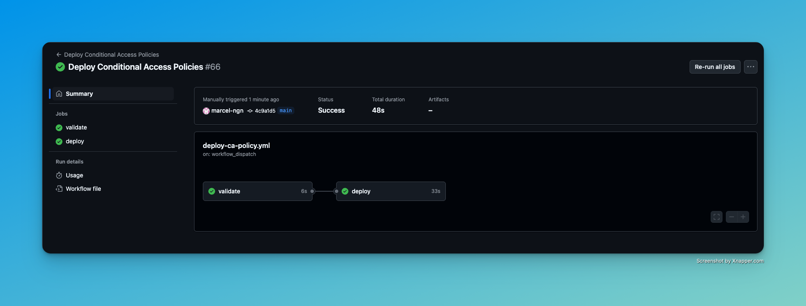
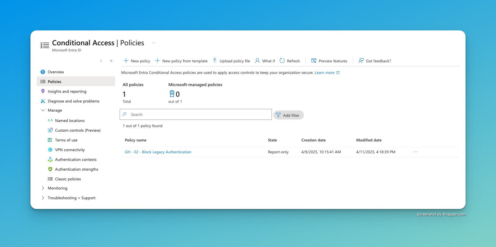
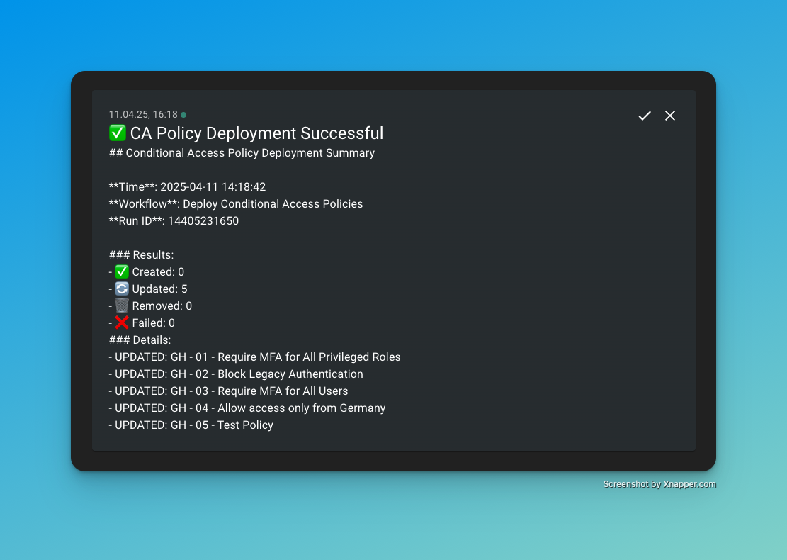

+++
authors = ["Marcel Nguyen"]
title = "Automating Azure Security: Deploying Conditional Access Policies via GitHub Actions"
date = "2025-04-10"
description = "IGA Insights"
tags = [
    "IaC", "Conditional Access", "Security", "GitHub", "Entra", "Azure"
]
categories = [
    "Security", "Automation"
]
series = [""]
+++

## Introduction

In this blog article, I want to show you how I built a proof-of-concept for deploying Conditional Access Policies in a DevOps approach via GitHub Actions.
I will use GitHub, GitHub Actions, and PowerShell to achieve that. 



## 🤔 Why should I create policies with GitHub, isn't that "overengineered"?

First of all, yes. It takes some time to configure the whole setup to deploy Conditional Access policies via code. You might be quicker by clicking through the Azure portal. However, this approach definitely brings some benefits with it:

### 1. Version Control and Audit
- Complete history of who changed what, when, and why through commit messages.

### 2. Automated Validation 
- You can automatically validate your policies before deploying. In my example, I am validating the file names and display names of the policies for a specific naming convention.

### 3. Peer Review Process
- You can set up an approval workflow in GitHub Actions which will require a review before deployment.

### 4. Reducing Attack Surface in Case Privileged Identity is Compromised
- Since policies will only be deployed by the GitHub Actions pipeline, no administrator will need permissions to change Conditional Access policies.

### 5. Backup
- In case you need quick disaster recovery, you can deploy everything back with one click.

I think there are even more advantages; however, I hope this should be enough to convince you to look into this.

## 👨‍💻 Let's Start to Build 

### Prerequisites

- GitHub account with repository
- Permission to create app registrations and grant admin consent 

### App Registration

#### Create the App Registration
We need an app registration in Entra ID. This app registration will have the permissions later to read and write Conditional Access policies. I will name it "github-actions".

To create the app registration, navigate in the search bar to "App Registrations" and click on "New Registration".


#### Assign API Permissions
We will need to assign API permissions in scope of Graph API to allow the application to read and write Conditional Access policies.

Select "API permissions" then "Add a permission". Add the following application permissions:

1. Policy.Read.ConditionalAccess
2. Policy.ReadWrite.ConditionalAccess

After assigning the permissions, click on "Grant admin consent for ..." to consent to the permissions.


#### Create Secret for Authentication
For my MVP version, I quickly created a set of client credentials consisting of a client-id, tenant-id, and a client-secret. However, this is not best practice, and you should look into federated credentials for your production environment.

To create a secret, click on "Certificates & secrets" and create a new client-secret in the "Client secrets" tab. Copy the value; we will need it later.



### Channel for Notification
Since I'm privately not using a communication platform like MS Teams or Slack, I need to send notifications to a ntfy.sh channel.
You can create and subscribe to one here: https://ntfy.sh/

### GitHub Repository 

#### Prepare Files and Folders
We will need the following three folders in our repository:
1. .github/workflows
2. policies
3. scripts

```
ca-policy-deployment-via-GHA/
│
├── .github/
│   └── workflows/
│       └── deploy-conditional-access.yml
│
├── policies/
│   ├── policy1.json
│   └── policy2.json
│
└── scripts/
    ├── validate-policies.ps1
    └── crud-policies.ps1
```

In the first folder, we will save the .yml file for our GitHub Actions pipeline. The second folder will contain all Conditional Access policies in JSON format, and the third folder will contain the two PowerShell scripts for validating the policies and creating the policies in Azure.

#### deploy-ca-policy.yml

A quick summary of the .yml file:

Workflow Name: Deploy Conditional Access Policies
Triggers:

Automatically runs when changes are pushed to the main branch in the policies/ directory
Can be manually triggered using workflow_dispatch


Job 1: Validate

Runs on Ubuntu
Checks out the repository code
Validates that policies follow the proper naming convention using a PowerShell script


Job 2: Deploy

Only runs after the validation job completes successfully
Runs on Ubuntu
Checks out the repository code
Installs and imports the Microsoft Graph PowerShell modules for identity management
Deploys the Conditional Access Policies using a PowerShell script (crud-policies.ps1)
Uses several secrets for authentication:

Azure client ID, tenant ID, and client secret
Notification URL


Passes workflow information to the deployment script

```yml
name: Deploy Conditional Access Policies
on:
  push:
    branches: [ main ]
    paths:
      - 'policies/**'
  workflow_dispatch:

jobs:
  # First job - validate policies
  validate:
    runs-on: ubuntu-latest
    steps:
      - name: Check out repository
        uses: actions/checkout@v3
      
      - name: Validate policy naming convention
        shell: pwsh
        run: ./scripts/validate-policies.ps1
  
  # Second job - deploy policies and notify
  deploy:
    needs: validate
    runs-on: ubuntu-latest
    steps:
      - name: Check out repository
        uses: actions/checkout@v3
      
      - name: Install Microsoft Graph PowerShell modules
        run: |
          Install-Module Microsoft.Graph.Identity.SignIns -Force -Scope CurrentUser
          Import-Module Microsoft.Graph.Identity.SignIns
        shell: pwsh
        
      - name: Deploy Conditional Access Policies and Send Notification
        id: deploy-policy
        env:
          AZURE_CLIENT_ID: ${{ secrets.AZURE_CLIENT_ID }}
          AZURE_TENANT_ID: ${{ secrets.AZURE_TENANT_ID }}
          AZURE_CLIENT_SECRET: ${{ secrets.AZURE_CLIENT_SECRET }}
          NTFY_URL: ${{ secrets.NTFY_URL }}
          WORKFLOW_NAME: ${{ github.workflow }}
          RUN_ID: ${{ github.run_id }}
        run: |
          ./scripts/crud-policies.ps1
        shell: pwsh
```

#### A Test Policy to Deploy 

```json
{
  "displayName": "GH - 02 - Block Legacy Authentication",
  "state": "enabledForReportingButNotEnforced",
  "conditions": {
    "userRiskLevels": [],
    "signInRiskLevels": [],
    "clientAppTypes": [
      "exchangeActiveSync",
      "other"
    ],
    "platforms": null,
    "locations": null,
    "deviceStates": null,
    "applications": {
      "includeApplications": [
        "All"
      ],
      "excludeApplications": [],
      "includeUserActions": []
    },
    "users": {
      "includeUsers": [
        "All"
      ],
      "excludeUsers": [],
      "includeGroups": [],
      "excludeGroups": [
        "ID-OF-YOUR-EXCLUSION-GROUP" 
      ],
      "includeRoles": [],
      "excludeRoles": []
    }
  },
  "grantControls": {
    "operator": "OR",
    "builtInControls": [
      "block"
    ],
    "customAuthenticationFactors": [],
    "termsOfUse": []
  },
  "sessionControls": null
}
```

This policy blocks legacy authentication for all users. It gets deployed in "Report only" mode.

#### validate-policies.ps1 
This script will validate our policies. In my example, it checks if the filename and displayName of the Conditional Access policies start with the prefix "GH -" to ensure all policies and files are following my naming convention.

```powershell
# Validate policy naming conventions
Write-Host "Starting policy validation..." -ForegroundColor Cyan

# Check if policies directory exists
if (-not (Test-Path -Path "./policies")) {
  Write-Host "Policies directory not found!" -ForegroundColor Red
  exit 1
}

# Find JSON files
$jsonFiles = Get-ChildItem -Path "./policies" -Filter "*.json" -File

if ($jsonFiles.Count -eq 0) {
  Write-Host "No policy files found in the policies directory." -ForegroundColor Yellow
  exit 0
}

Write-Host "Found $($jsonFiles.Count) policy files. Validating naming conventions..." -ForegroundColor Cyan

$fileNamingErrors = 0
$displayNameErrors = 0
$jsonFormatErrors = 0

foreach ($file in $jsonFiles) {
  # Check file name
  if (-not $file.Name.StartsWith("GH - ")) {
    Write-Host "File $($file.Name) does not follow the naming convention 'GH - '" -ForegroundColor Red
    $fileNamingErrors++
  }
  
  # Check display name in JSON
  try {
    $policyContent = Get-Content -Path $file.FullName | ConvertFrom-Json
    $displayName = $policyContent.displayName
    
    if (-not $displayName.StartsWith("GH - ")) {
      Write-Host "Policy in $($file.Name) has displayName '$displayName' which does not follow the naming convention 'GH - '" -ForegroundColor Red
      $displayNameErrors++
    }
  } catch {
    Write-Host "Failed to parse JSON in file $($file.Name): $_" -ForegroundColor Red
    $jsonFormatErrors++
  }
}

# Report results
Write-Host "`nValidation complete." -ForegroundColor Cyan
Write-Host "File naming errors: $fileNamingErrors" -ForegroundColor $(if ($fileNamingErrors -gt 0) { "Red" } else { "Green" })
Write-Host "Display name errors: $displayNameErrors" -ForegroundColor $(if ($displayNameErrors -gt 0) { "Red" } else { "Green" })
Write-Host "JSON format errors: $jsonFormatErrors" -ForegroundColor $(if ($jsonFormatErrors -gt 0) { "Red" } else { "Green" })

# Fail if any errors were found
if ($fileNamingErrors -gt 0 -or $displayNameErrors -gt 0 -or $jsonFormatErrors -gt 0) {
  Write-Host "`nValidation failed. Please fix the issues above." -ForegroundColor Red
  exit 1
} else {
  Write-Host "`nAll policy files and display names follow the naming convention!" -ForegroundColor Green
  exit 0
}
```

#### crud-policies.ps1 
This is the last script which will deploy the Conditional Access policies in Entra ID. It will also send a notification to my ntfy.sh channel.

```powershell
# Connect to Microsoft Graph
$ApplicationId = $env:AZURE_CLIENT_ID
$SecuredPassword = $env:AZURE_CLIENT_SECRET
$tenantID = $env:AZURE_TENANT_ID
$ntfyUrl = $env:NTFY_URL
$workflowName = $env:WORKFLOW_NAME
$runId = $env:RUN_ID

# Create secure credential
$SecuredPasswordPassword = ConvertTo-SecureString -String $SecuredPassword -AsPlainText -Force
$ClientSecretCredential = New-Object -TypeName System.Management.Automation.PSCredential -ArgumentList $ApplicationId, $SecuredPasswordPassword

# Connect to Microsoft Graph
Connect-MgGraph -TenantId $tenantID -ClientSecretCredential $ClientSecretCredential | Out-Null

# Define the path to the directory containing your JSON files
$jsonFilesDirectory = "./policies/"

# Get all JSON files in the directory
$jsonFiles = Get-ChildItem -Path $jsonFilesDirectory -Filter *.json

# Initialize counters for summary
$created = 0
$updated = 0
$removed = 0
$failed = 0
$summary = @()

# Get existing policies
Write-Host "Retrieving existing policies..." -ForegroundColor Cyan
$existingPolicies = Get-MgIdentityConditionalAccessPolicy

# Create a hashtable of policies defined in JSON files
$definedPolicies = @{}
if ($jsonFiles.Count -gt 0) {
    foreach ($jsonFile in $jsonFiles) {
        try {
            $policyJson = Get-Content -Path $jsonFile.FullName | ConvertFrom-Json
            $definedPolicies[$policyJson.displayName] = $jsonFile.FullName
        } catch {
            Write-Host "Error reading policy file $($jsonFile.FullName): $_" -ForegroundColor Red
            $failed++
            $summary += "FAILED TO READ: $($jsonFile.FullName) - Error: $_"
        }
    }
}

# First, process existing policies that need to be updated or removed
foreach ($existingPolicy in $existingPolicies) {
    # Skip policies that don't follow our managed naming convention
    if (!$existingPolicy.DisplayName.StartsWith("GH - ")) { continue }
    
    if ($definedPolicies.ContainsKey($existingPolicy.DisplayName)) {
        # Policy exists in repo - it will be processed in the next loop
        continue
    } else {
        # Policy exists in Azure but not in repo - delete it
        try {
            Write-Host "Removing policy no longer in repository: $($existingPolicy.DisplayName)" -ForegroundColor Magenta
            Remove-MgIdentityConditionalAccessPolicy -ConditionalAccessPolicyId $existingPolicy.Id
            Write-Host "Policy removed successfully: $($existingPolicy.DisplayName)" -ForegroundColor Green
            $removed++
            $summary += "REMOVED: $($existingPolicy.DisplayName)"
        } catch {
            Write-Host "Error removing policy $($existingPolicy.DisplayName): $_" -ForegroundColor Red
            $failed++
            $summary += "FAILED TO REMOVE: $($existingPolicy.DisplayName) - Error: $_"
        }
    }
}

# Now process the JSON files for creation/update
foreach ($jsonFile in $jsonFiles) {
    try {
        # Read the content of the JSON file and convert it to a PowerShell object
        $policyJson = Get-Content -Path $jsonFile.FullName | ConvertFrom-Json

        # Create a custom object
        $policyObject = [PSCustomObject]@{
            displayName     = $policyJson.displayName
            conditions      = $policyJson.conditions
            grantControls   = $policyJson.grantControls
            sessionControls = $policyJson.sessionControls
            state           = $policyJson.state
        }

        # Convert the custom object to JSON with a depth of 10
        $policyJsonString = $policyObject | ConvertTo-Json -Depth 10

        # Check if a policy with the same display name already exists
        $existingPolicy = $existingPolicies | Where-Object { $_.DisplayName -eq $policyJson.displayName }

        if ($existingPolicy) {
            # Update the existing policy
            Write-Host "Policy already exists: $($policyJson.displayName) - Updating..." -ForegroundColor Yellow
            $null = Update-MgIdentityConditionalAccessPolicy -ConditionalAccessPolicyId $existingPolicy.Id -Body $policyJsonString
            Write-Host "Policy updated successfully: $($policyJson.displayName)" -ForegroundColor Green
            $updated++
            $summary += "UPDATED: $($policyJson.displayName)"
        } else {
            # Create a new policy
            Write-Host "Creating new policy: $($policyJson.displayName)" -ForegroundColor Cyan
            $null = New-MgIdentityConditionalAccessPolicy -Body $policyJsonString
            Write-Host "Policy created successfully: $($policyJson.displayName)" -ForegroundColor Green
            $created++
            $summary += "CREATED: $($policyJson.displayName)"
        }
    }
    catch {
        # Print an error message if an exception occurs
        Write-Host "An error occurred while processing the policy file '$($jsonFile.FullName)': $_" -ForegroundColor Red
        $failed++
        $summary += "FAILED: $($jsonFile.Name) - Error: $_"
    }
}

# Print summary
Write-Host "`nDEPLOYMENT SUMMARY:" -ForegroundColor Cyan
Write-Host "Policies Created: $created" -ForegroundColor Green
Write-Host "Policies Updated: $updated" -ForegroundColor Yellow
Write-Host "Policies Removed: $removed" -ForegroundColor Magenta
Write-Host "Operations Failed: $failed" -ForegroundColor $(if ($failed -gt 0) { "Red" } else { "Green" })
Write-Host "`nDetailed Results:" -ForegroundColor Cyan
$summary | ForEach-Object { Write-Host $_ }

# Send notification
Write-Host "`nSending notification..." -ForegroundColor Cyan

# Build detailed message
if ($failed -gt 0) {
    $title = "CA Policy Deployment Completed with Errors"
    $priority = "high"
    $tags = "warning"
} else {
    $title = "CA Policy Deployment Successful"
    $priority = "default"
    $tags = "white_check_mark"
}

$timestamp = (Get-Date).ToString("yyyy-MM-dd HH:mm:ss")

$message = @"
## Conditional Access Policy Deployment Summary

**Time**: $timestamp
**Workflow**: $workflowName
**Run ID**: $runId

### Results:
- ✅ Created: $created
- 🔄 Updated: $updated
- 🗑️ Removed: $removed
- ❌ Failed: $failed

"@

# Add details if there are any
if ($summary.Count -gt 0) {
    $message += "### Details:`n"
    foreach ($detail in $summary) {
        $message += "- $detail`n"
    }
}

# Send notification
$headers = @{
    "Title" = $title
    "Priority" = $priority
    "Tags" = $tags
}

try {
    Write-Host "Sending notification to $ntfyUrl" -ForegroundColor Cyan
    Invoke-RestMethod -Method Post -Uri $ntfyUrl -Headers $headers -Body $message
    Write-Host "Notification sent successfully" -ForegroundColor Green
} catch {
    Write-Host "Failed to send notification: $_" -ForegroundColor Red
    # Continue execution even if notification fails
}
```

### GitHub Actions Secrets
We will need to store sensitive information such as client-id and client-secret in our repository.
Go to "Settings" then "Secrets and variables". Under Actions, you can create new repository secrets. Create the following:

1. AZURE_CLIENT_ID
2. AZURE_CLIENT_SECRET
3. AZURE_TENANT_ID
4. NTFY_URL



### Start Your First Pipeline Run
If everything is set up correctly, you should be able to execute the workflow. Go to "Actions". Select "Deploy Conditional Access Policies" on the left side and Run the workflow.







### Result in Entra ID
You can see that the policy has been deployed successfully to Entra ID.



I also received a notification via ntfy.sh



## Conclusion

This approach provides a robust way to manage Conditional Access policies as code, offering benefits such as version control, automated validation, peer reviews, reduced attack surface, and easy disaster recovery. By leveraging GitHub Actions and PowerShell, you can automate the deployment process and maintain consistent security policies across your environment.
The code is also available on [GitHub](https://github.com/marcel-ngn-lab/ca-policy-deployment-via-GHA).

⚠️ **Disclaimer**: This content reflects my personal experience. 
Please refrain from executing any code unless you fully understand it.